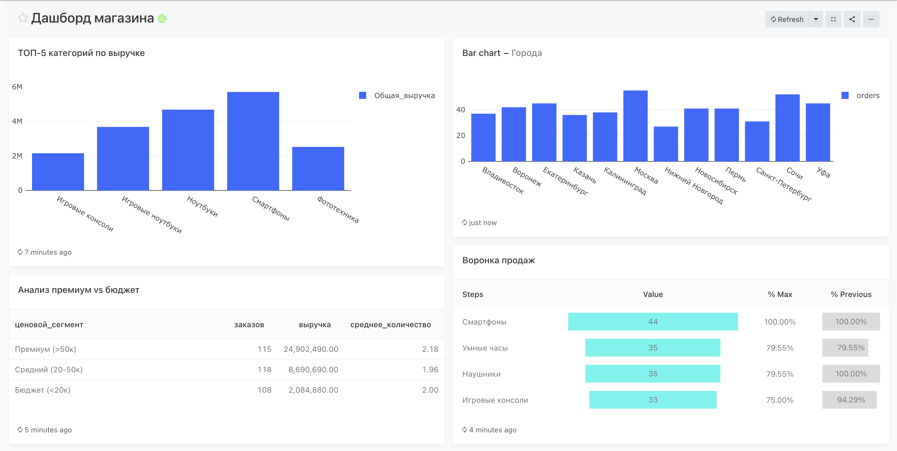
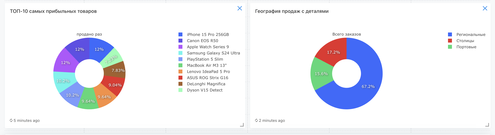

# Система сбора данных интернет-магазина

## Описание
End-to-end система для сбора и анализа данных о заказах в интернет-магазине.

## Стек технологий
- Python (генератор данных)
- PostgreSQL (база данных)
- Redash (визуализация)
- Docker (контейнеризация)

## Данные
Собираем информацию о заказах: товар, категория, цена, количество, город.

## Результаты работы

Дашборд содержит 6 визуализации:

- Топ-5 категорий по выручке
- Количество заказов в городах
- Анализ премиум vs бюджет
- Воронка продаж
- Топ-10 самых прибыльных товаров
- География продаж с деталями

## Структура данных
Таблица orders:

- order_id (ID заказа: автоинкремент)
- product_id (ID товара: 1-10)
- product_name (название товара: Смартфон, Ноутбук и др.)
- category (категория: Электроника, Одежда, Бытовая техника, Книги)
- price (цена: 890.0-129990.0)
- quantity (количество: 1-3)
- city (город: Москва, Владивосток, Новосибирск, Сочи, Калининград)
- order_date (время заказа)

## Подключение
- Redash: http://localhost:5001
- База: online_store_db
- Пользователь: postgres
- Пароль: mysecretpassword